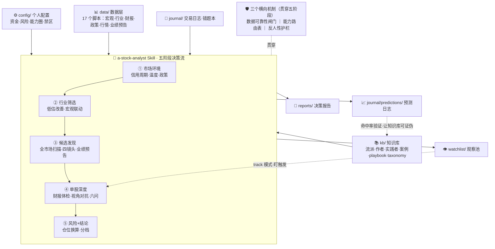

# CC Awesome Stock — A股分析知识库 + 选股 Skill

面向 A 股的股票分析与选股决策辅助系统。

## 系统构成



**输入层**
- **config/**：个人投资档案（资金/风险/仓位规则/禁区）和能力圈，所有报告的根输入
- **kb/**：蒸馏自多位优秀分析者的方法论知识库——`schools/`（6流派）`authors/`（18作者）`retail-practitioners/`（11实践者）`cases/`（典型案例）`playbooks/` `taxonomy/`（含能力路由表、宏观-行业映射）
- **data/**：基于 akshare 的数据层——`stock_data/`（数据模块）+ `scripts/`（17 个 CLI 脚本）
- **journal/**：交易日志（`trades/`）、错题本（`lessons/`）、预测日志（`predictions/`）

**决策流**
- **.claude/skills/a-stock-analyst/** 和 **.agents/skills/a-stock-analyst/**：Claude / Codex 双入口，同一套五阶段分析规则

**输出与闭环**
- **reports/**：结构化决策报告 + 执行信号表
- **watchlist/**：观察池——把一次性研究变成持续盯触发的活标的
- **journal/predictions/**：预测日志——每个判断留痕、事后验证命中率，让知识库可证伪
- **backtest/**：量化回测（骨架）

## 快速使用

### 1. 安装数据层

```bash
cd data
pip install uv
uv venv && source .venv/bin/activate
uv pip install -e ".[dev]"
```

### 2. 建立个人配置

真实配置不进 git。首次使用时复制 example 文件并按自己的资金、风险、能力圈修改：

```bash
cp config/personal-profile.example.yaml config/personal-profile.yaml
cp config/circle-of-competence.example.yaml config/circle-of-competence.yaml

# 检查仓位规则、止损线和默认值
cd data
python scripts/position_calc.py --check-profile
```

如果 `meta.owner` 为空，说明可能仍是模板默认值；报告会把仓位、止损和能力圈判断视为通用假设。

### 3. 验证数据脚本

```bash
cd data
python scripts/snapshot_market.py
python scripts/snapshot_stock.py 600519.SH
python scripts/screen_sectors.py --top 5
python scripts/snapshot_macro.py
python scripts/snapshot_industry.py --top 10
python scripts/financial_check.py 600519.SH
python scripts/position_calc.py 600519.SH --pct 5
```

### 4. 使用 Skill

在 Claude Code 中（项目目录下），直接对话：

```
"现在 A 股值得关注什么方向？"
"帮我分析 600519.SH"
"AI 板块里挑几只中线标的"
```

Skill 会自动按五阶段流程输出结构化报告和执行信号表，包括：能不能动、怎么动、仓位上限、触发条件、止损/退出条件和最大反对理由。

## 知识库扩展

### 添加新作者档案

```bash
cp kb/authors/_template.md kb/authors/<slug>.md
# 编辑档案，参考 william-oneil.md / lin-yuan.md / feng-liu.md
# 更新 kb/authors/_index.md
```

### 添加案例

```bash
cp kb/cases/_template.md kb/cases/<ticker>-<event>-<YYYY-MM-DD>.md
```

### 记录交易日志

```bash
cp journal/trades/_template.md journal/trades/YYYY-MM-DD-TICKER.md
```

### 记录错题本

```bash
cp journal/lessons/_template.md journal/lessons/YYYY-MM-DD-short-title.md
```

## MVP 内容清单

### 已完成（MVP）

- **流派档案** (6个): 主线资金/产业趋势/基本面财报/趋势成长/长期价值/逆向赔率
- **作者档案** (18个): William O'Neil / 林园 / 冯柳 / 段永平 / 唐朝 / 邱国鹭 / 高善文 / 任泽平 / 巴菲特 / 芒格 / Howard Marks / 张坤 / 朱少醒 / 但斌 / 董宝珍 / 李蓓 / Peter Lynch / 姜诚
- **散户实践者档案** (11个): 长期配置/ETF、A股短线情绪、泛财经/外盘映射、基本面深度研究（里海）四组
- **典型案例** (4个): 茅台长期价值 / 白酒反腐逆向 / 半导体CANSLIM / 医药集采分化
- **Playbooks** (6个): 大盘判断/行业筛选/公司映射/买卖规则/风险检查/里海单股研究清单
- **Taxonomy** (5个 YAML): schools/themes/industry-mapping/capability-matrix/macro-industry-mapping
- **能力路由表**: 按"分析环节+市场状态+股票类型"路由视角，取代无脑全员交叉验证，含结构化反对机制
- **选股漏斗**: `screen_all_market.py` 全市场扫描——纯流动性初筛（不漏未启动标的）+ 四镜头评分（value/growth/reversal/composite）+ 宏观联动加减分
- **系统闭环**: `watchlist/`（观察池，研究→持续盯触发）+ `journal/predictions/`（预测日志，每个判断留痕、事后验证命中率），让知识库可证伪
- **领先信号层**: 业绩预告雷达（`earnings_radar.py`，A股强制披露的前瞻信号）+ 信贷脉冲前瞻——让选股从"猎捕当前状态"转向"猎捕正在变好"
- **数据可靠性闸门**: `data_health.py` 飞行前体检 + 各数据点新鲜度标签——过期/失效数据显式告警并降级，不在陈旧数据上做决策
- **反人性护栏**: `behavior_check.py` 检测追高/FOMO、反复改主意、连续亏损冷静期、过度交易、亏损加仓——散户亏钱主因是行为，决策前先把陷阱摆上台面
- **真实数据分析层**: 宏观、行业基本面、公司财报、政策事件四条数据流
- **个人化基础层**: 个人投资档案、能力圈、仓位换算、交易日志汇总、错题本
- **数据脚本** (17个): snapshot_market / snapshot_macro / snapshot_industry / snapshot_stock / screen_all_market / screen_sectors / screen_by_criteria / financial_check / policy_track / position_calc / journal_summary / find_similar_cases / earnings_radar / data_health / watchlist / prediction_log / behavior_check
- **回归测试** (67项): 数据层、选股漏斗、系统闭环、领先信号、数据闸门、反人性护栏
- **Skill**: `.claude/skills/a-stock-analyst/` 和 `.agents/skills/a-stock-analyst/` 双入口

### 待建（按优先级）

- 决策结构：`thesis card`、核心假设生命周期、机会成本对照、组合层约束（TODO P2）
- 持续追踪自动化：`reports/tracking/` 自动归档、收盘后定时复查 watchlist
- 美联储利率数据源修复（akshare 接口冻结，闸门已能识别降级）
- 领先信号增强：盈利预测调整趋势、在手订单增速等更细粒度边际因子
- 回测骨架：定义第一版公共接口，加入防过拟合护栏（TODO P5）
- 知识库补全：更多典型案例、失败案例

## 重要约束

1. 不把任何单一作者当权威
2. 每个判断必须标 [事实/推断/假设/情绪/传闻]
3. 不输出无依据的荐股
4. 散户实践者观点只能用于执行适配和替代方案比较，不作为单股背书
5. 输出足够可执行的信号建议：能不能动、怎么动、仓位上限、触发条件和退出条件；最终执行由用户自行判断

## 数据来源

主要：[akshare](https://akshare.akfamily.xyz/)（免费，无需 token）

可选增强：tushare（需申请 token，在 data/.env 中配置）
